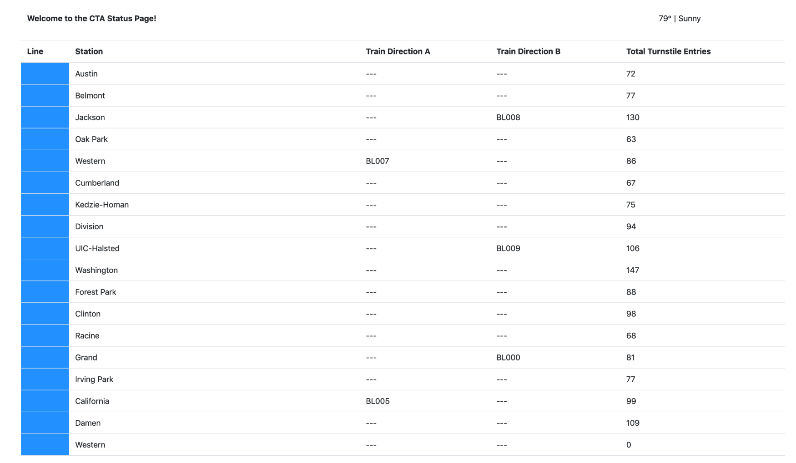

# Optimizing Public Transportation Using Kafka Streaming
## Project Motivation
This project constructs a streaming event pipeline around Apache Kafka and its ecosystem. Using public data from the Chicago Transit Authority we will construct an event pipeline around Kafka that allows us to simulate and display the status of train lines in real time.  At the end of this project we will be able to monitor current weather and train status in real time as shown below.

## Project Overview
The project contains the following components:
- Use REST Proxy to send events over HTTP
- Use Kafka Connect to collect data from the Postgres database and stream them into Kafka
- Use KSQL to combine related data models into a single topic ready for consumption for downstream analytics
- Use the Faust Python Stream Processing library to transform train station data into a more streamlined representation



## Project Architecture
The Chicago Transit Authority (CTA) has asked us to develop a dashboard displaying system status for its commuters. We have decided to use Kafka and ecosystem tools like REST Proxy and Kafka Connect to accomplish this task.

Our architecture will look like so:


## File Structure
The project consists of two main directories, **producers** and **consumers**.

The following directory layout indicates the files that the student is responsible for modifying by adding a * indicator. Instructions for what is required are present as comments in each file.

```
Optimizing Public Transportation
|____README.md
|____startup.sh
|
|____ producer
| |____ __init__.py
| |____ connector.py                 * Kafka Connect to Postgres
| |____ simulation.py
| |____ logging.ini
| |____ requirements.txt
| |
| |____ data                         * Data for simulation
| | |____ ridership_curve.csv
| | |____ cta_stations.csv
| | |____ README.md
| | |____ ridership_seed.csv
| |
| |____ models                       * Define Kafka Producer
| | |____ __init__.py
| | |____ producer.py
| | |____ station.py
| | |____ turnstile.py
| | |____ weather.py
| | |____ turnstile_hardware.py
| | |____ line.py
| | |____ train.py
| | |
| | |____ schemas                    * Define Avro schema
| | | |____ arrival_key.json
| | | |____ arrival_value.json
| | | |____ turnstile_key.json
| | | |____ turnstile_value.json
| | | |____ weather_value.json
| | | |____ weather_key.json
|
|____ consumer
| |____ __init__.py
| |____ server.py                    * Server for running Web UI
| |____ logging.ini
| |____ requirements.txt
| |____ topic_check.py
| |____ faust_stream.py              * Using Faust to tranform station data
| |____ consumer.py
| |____ ksql.py                      * Using KSQL to transform turnstile data
| |____ templates
| | |____ status.html
| |
| |____ models                       * Define Kafka Consumer
| | |____ __init__.py
| | |____ line.py
| | |____ weather.py
| | |____ lines.py
| | |____ station.py

```
## Running the Simulation
To run the producer
- cd producer
- python simulation.py

To run the Faust Stream Processing Application
- cd consumer
- faust -A faust_stream worker -l info

To run the KSQL Creation Script
- cd consumer
- python ksql.py

To run the consumer
- cd consumer
- python server.py

When the producer and consumer are running, the following URLs will be available.


